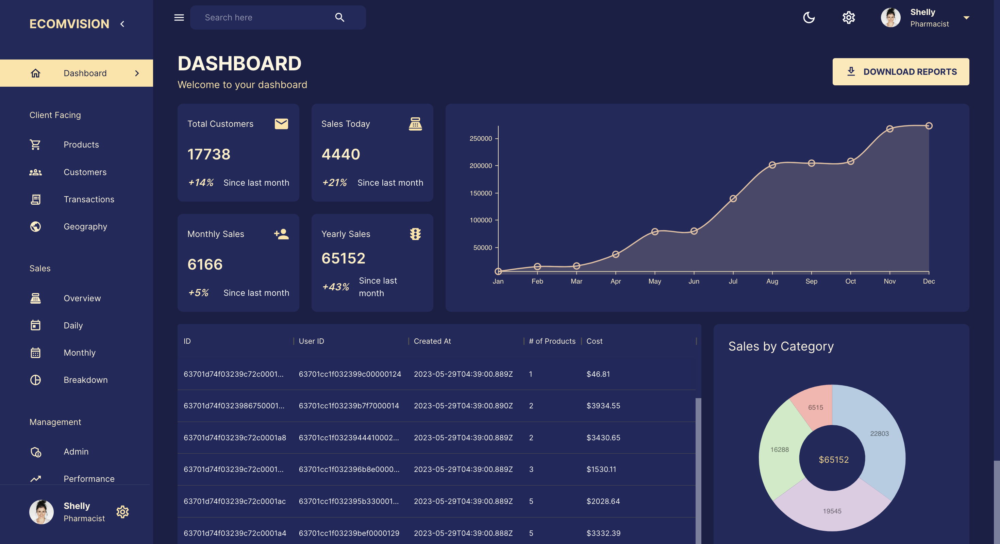
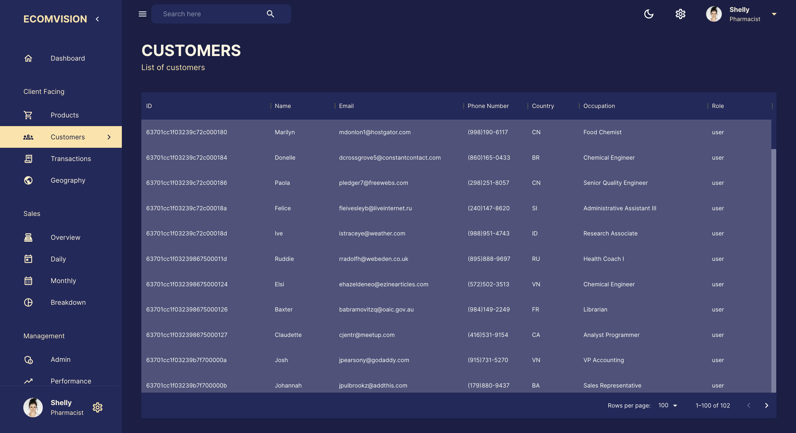
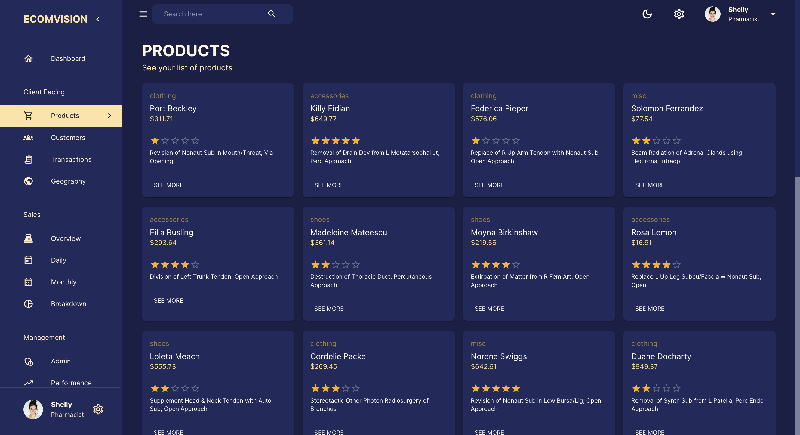
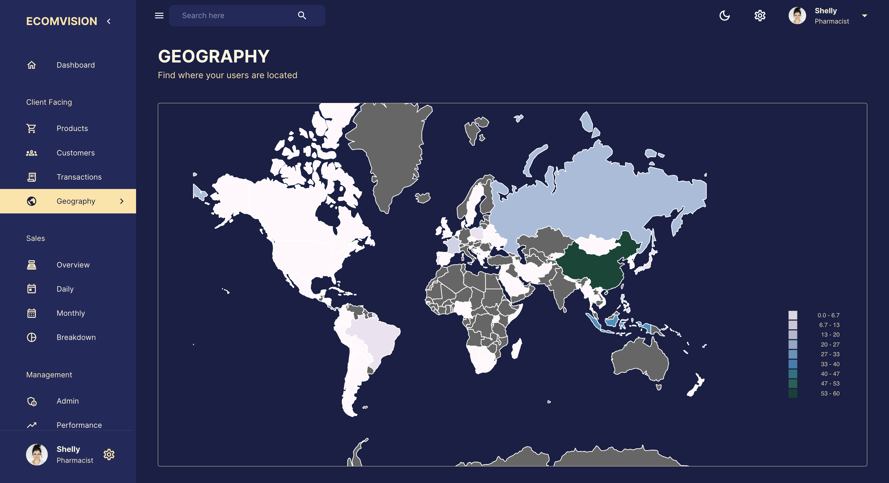
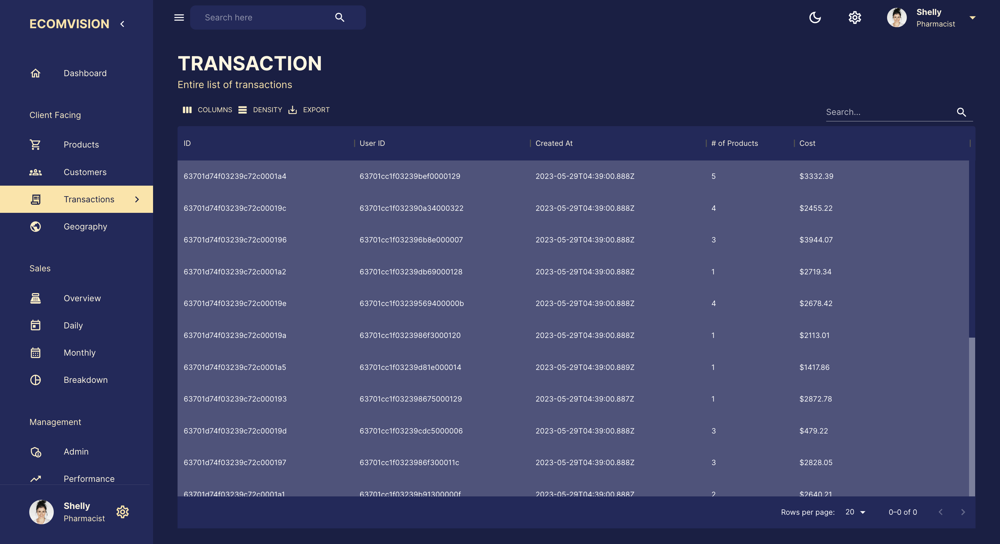

# React Dashboard with a backend

The project involved the development of a client and server side to demonstrate the financial status of a company. From Nivo charts to MUI Data grids to display data and RTK queries to make API calls for the developed APIs via MongoDB.

## **Library Installation**
The command below is executed to install the required libraries.

```javascript
    npm i
```

## **Run the application**
The command below is issued to intiate the application from both the client and server sides.

```javascript
    npm start
```

## **Dashboard Demostration**
Provided below are a snippets from the application. For a motion demo of the application, a video with the name 'demo.mp4' in the rep_assets directory will provide an insight into the entire working application and its flow.
<div>
    
    
    
    
    
</div>
